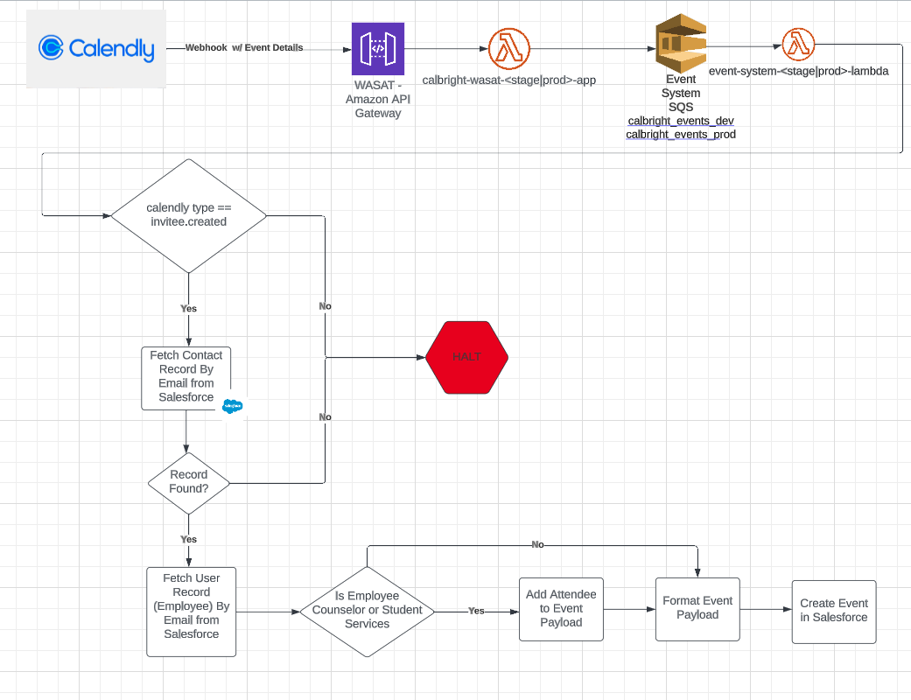

# calendly_event

## What
This event is fired when any event action occurs within Calendly. The initial webhooks were setup using Calendly's Webhook API with the following body:

POST /webhook_subscriptions
```
{
    "url": "https://event-api-stage.calbrightcollege.org/calendly",
    "events": [
        "invitee.created"
    ],
    "organization": "https://api.calendly.com/organizations/BBAAE7NUVMNFSFBR",
    "scope": "organization",
    "signing_key": "ad484c01-c58a-4be8-b078-87990b11f63c"
}
```

See Calbright Collection (Calendly) for additional information

### Invitee.Created
If an event is received where the calendly type is invitee.created the following steps are preformed:

1. Fetch the Salesforce "Contact" record by matching on Calbright or personal email from the event email
   1. If there is no matching email the event processing stops
2. Retrieve the User and Event Type Data from Calendly APIs
3. Fetch the Salesforce "User" record (Employee Record)
   1. If the "User" title is either "Counselor" or "Student Services" then add the Salesforce ID to the event payload
4. Format the Event Payload with data from Calendly webhook
5. Create the Event on the Salesforce Student Record

### Monitoring & Alerting
TBD

### Workflow Diagram
