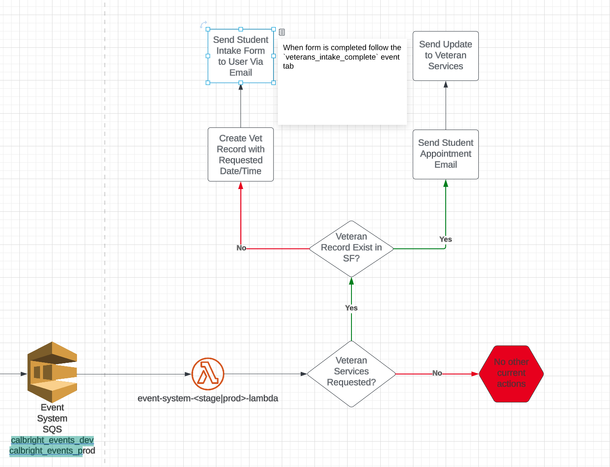

# csep_complete

## What
This event is fired when a student completes a CSEP and additional actions or services are requested
within the CSEP (i.e. veteran services)

### Veteran Services
If Veteran Services are requested on the CSEP the following steps are taken:

Is there a Veteran Record already attributed to the student on Salesforce?
1. Yes:
   1. Send an Email to the student to ask them to make an appointment with the Veteran Services Team
   2. Send an email to the Veteran Services team to inform them they have a student requesting services
2. No:
   1. Add the CSEP date completed to the Salesforce Record `Veteran Services Request Date/Time`
   2. Send an Email with the Veteran Services Intake Form (google doc) to the student

 - [Asana Task](https://app.asana.com/0/1204556403808586/1204556403808590/f)

### Monitoring & Alerting
TBD

### Workflow Diagram
