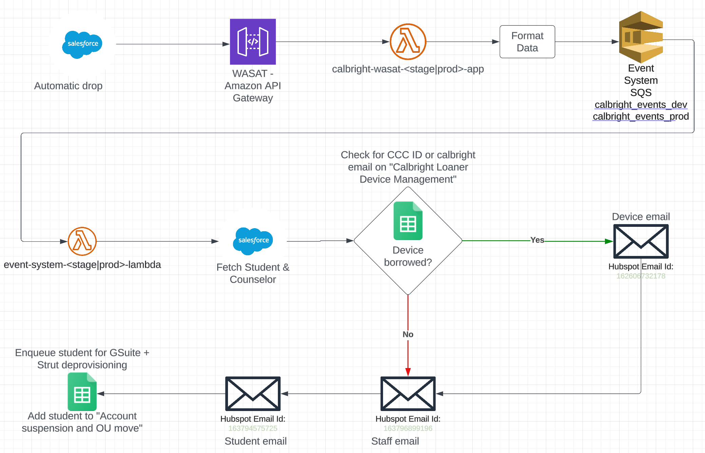

# salesforce_event

## What
This event is fired when a Salesforce automation drops NP students.

It replaces current (as of 2024-04) Zapier functionality here: https://zapier.com/editor/96284215/published/98946132/setup

### Salesforce Event / Automatic Drop
The following steps are taken once this event is received:
 1. Receive and minimally check / process data from the Salesforce NP automation.
 2. Perform Salesforce queries for additional student and counselor details.
 3. Check Google Spreadsheet to determine if the student has borrowed any devices.
 3a. Send an email to the student about borrowed device(s).
 4. Send an email to the student about having been dropped.
 5. Send an email to Calbright staff informing them about the dropped student.\
 6. Add student to a deprovisioning Google Spreadsheet.

 - [Asana Task](https://app.asana.com/0/1182443435901508/1206720304961918/f)

### Monitoring & Alerting
TBD

### Workflow Diagram
