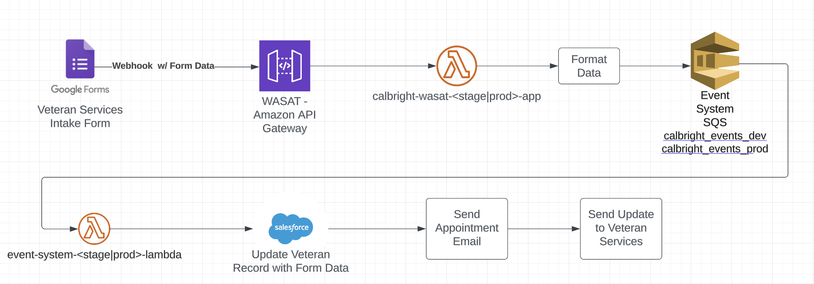

# veterans_intake_complete

## What
This event is fired when a student fills out the Veteran Services intake form. It is sent by google forms with all
form data the student has filled in.

### Veteran Services Intake Form Complete
The following steps are taken once this event is received:
 1. The data from the google form is used to update the veteran services record in sales force
 2. Send an Email to the student to ask them to make an appointment with the Veteran Services Team
 3. Send an email to the Veteran Services team to inform them they have a student requesting services

 - [Asana Task](https://app.asana.com/0/1204556403808586/1204556403808598/f)

### Monitoring & Alerting
TBD

### Workflow Diagram
